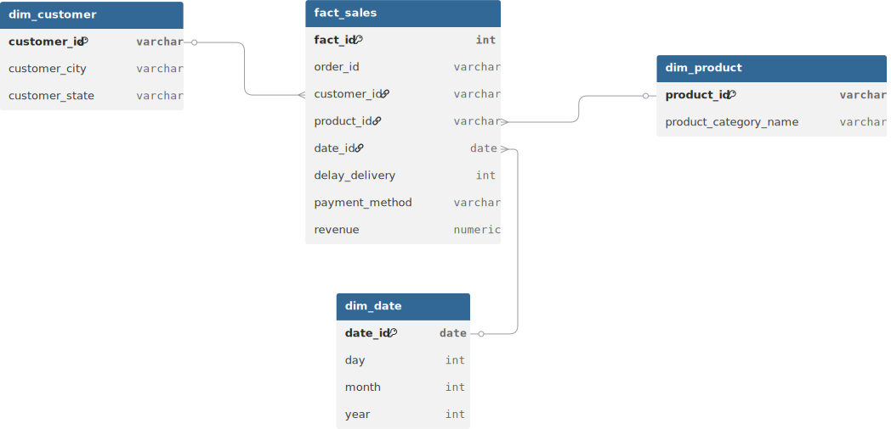

# E-Commerce data engineering and analysis

## Description
Pipeline ETL automatisé permettant la collecte de données opérationnelles d’un site e-commerce, leur transformation et leur chargement dans un Data Warehouse, afin de générer des tableaux de bord de suivi des indicateurs clés de performance (KPIs).

## Technologies
- Apache Airflow (orchestration)
- Python & Pandas (data transformation)
- PostgreSQL (Data warehouse)
- Tableau (dasboarding)
- Docker (Containerisation)
- Git, Github (Versioning)
## Raw Dataset 
<a href="https://www.kaggle.com/datasets/bytadit/ecommerce-order-dataset"> Lien vers le dataset </a>

Structure des tables 
```js
Orders (order_id, customer_id, order_status, order_purchase_timestamp, order_approved_at, order_delivered_timestamp, order_estimated_delivery_date)

Customers (customer_id, customer_zip_code_prefix, customer_city, customer_state)

OrderItems (order_id, product_id, seller_id, price, shipping_charges)

Payments (order_id, payment_sequential, payment_type, payment_installments, payment_value)

Products (product_id, product_category_name, product_weight_g, product_length_cm, product_height_cm, product_with_cm)
```

## Les indicateus (KPIs)
- le chiffre d'affaires (par jours, mois, annee)
- Top 10 des meilleurs clients (nbre d'achat)
- Top 10 des produits les plus vendus
- Répartition des ventes par catégorie de produits
- Répartition des ventes par état et par ville
- Suivi des délais de livraison

## Modelistion du datawarehouse



**Fact table**
```
fact_sales
- fact_id
- order_id
- customer_id
- product_id
- order_purchase_date
- order_delivered_timestamp
- revenue (price + shipping_charges)
```
**Dimension tables**
```
dim_customer
- customer_id
- customer_city
- customer_state
```

```
dim_product
- product_id
- product_category_name
```

```
dim_date
- date_id
- day
- month
- year
```

## Launch pipeline

- Start Airflow
```bash 
mkdir -p ./logs ./config
echo -e "AIRFLOW_UID=$(id -u)" > .env
docker compose run airflow-cli airflow config list
docker compose up airflow-init
docker compose up 
```

Open the address <a href='http://localhost:8080'> to see the airflow panel. The login credentials is `airflow` for the username and `airflow` for the password. 

En suite il faut creer une connection a la base de donnees en allant dans `Admin >  connections > add Connections` et les informations de la base de donnees sont: 
 - username: warehouse
 - password: warehouse
 - database: warehouse
 - host: postgres-warehouse
 - port: 5432 (internal port, external port is 5433)